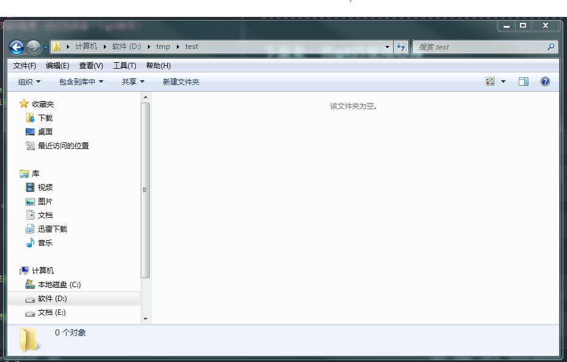
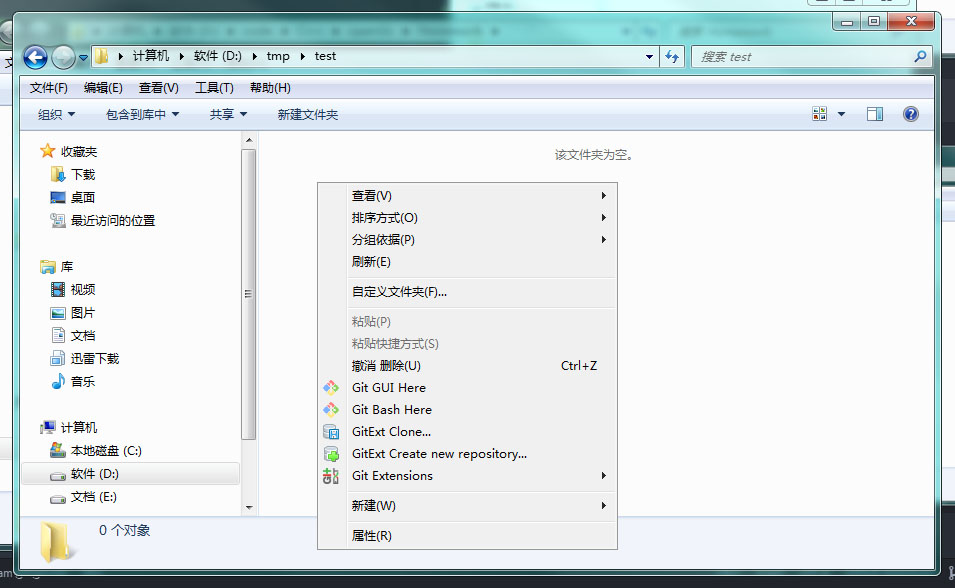

# git 使用记录
***
git 在我看来是很重要的，怎么重要现在我的概念还不是太清楚，等我用一段时间以后补充
***

## 下面是一些git的使用心得

### 一、git 的初步使用基本配置步骤：
#### 1.git 的初始化：用户名和邮箱的配置（自己先申请一个git账号）
```
设置命令和方法如下：
```
```
git config --global user.name "这里填写你的用户名"
git config --global user.email "这里填写你的邮箱"
```
```
这样就配置好了用户
```

#### 2.创建版本库
```
到你想要将其内容上传git的目录下，运行下面的命令：
```
```
git init
```
```
我来演示一下，我是window系统，安装的是 git for window ，通过下面的步骤完成创建：
```
```
比如我想让 D:\tmp\test 这个目录创建版本库，想进入 D:\tmp\test 目录下：
```

```
然后鼠标右键，弹出如下的鼠标菜单选项：
```

